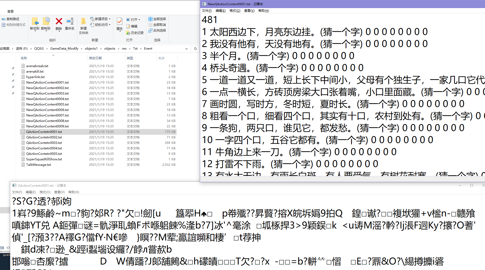

#### （科普&技术）脚本？黑屏？背后的原理你知道吗

利益相关：三国十三年忠实粉丝，今大三计算机在读，想借此机会跟大家聊聊在三国你能遇到的辅助，究竟是什麽原理。

在这里，你可以猎奇，可以吃瓜，可以收获知识，可以跟着本文一起，一起探究计算机的奥秘。


声明：

1、读完本贴，你可能会觉得，脚本不过如此，黑屏原来这么简单。 并自我实践后，觉得非常方便，非常奇妙，市场对其需求肯定很大，想通过将其出售他人获得利益。脚本制作是违法的事情，起码是不道德的。本贴的目的在于给广大计算机爱好者，给予一个学习的途径。不至于像我一样四处碰壁一两年才大致弄懂。

2、脚本原理不难，难的是发掘它，制作它的过程。本文适合计算机爱好者，适合三国工作生活之余，获得一点知识的同学，适合想提升代码能力的同学。

3、本人制作的脚本仅个人使用，未曾使用其获利，本帖不提供完整源码，也不提供制作的脚本。未来考虑开源，但暂不在考虑范围内。


二楼：占用，用来更新信息。


[TOC]


##### 1、什麽是脚本挂、内存挂

​		这个是比较感性的问题，相关讨论可以移步知乎

​		个人而言，脚本是机器人模拟人操作，比如识图+按键精灵，而外挂是通过改写内存达到自我需求，比如cheat engine，Ollydbg  俗称（CE,OD）

​		为了写这个帖子（博客），我研究好一会儿内存辅助是什麽（大概研究了两天）。但是没什么太大的进展，只知道三国是存在内存挂的，而且基本上现在的脚本，用的大部分就是内存挂。内存挂是什麽来的呢？简单来说，就是通过逆向三国，解析出来一些有用的“数据、以及函数”。比如用1、读取拼图打乱后的序列内存，然后加之以算法得到解题过程。2、逆向自动寻路call，从而可以通过调用三国内部的自动寻路。3、改写内存，修改使得行脚地图中允许自动寻路。4、逆向出来任务数据，通过对比解包出来的任务文本，进行主/支线任务的做。5、逆向题库（题库里面是有选项的，直接告诉你正确答案是第几个），直接答题。等等……

​		还有很多其他的。但本人能力有限。逆向工程这个分支还不是特别的懂，甚至可以说连入门都还没有。于是本文，就不班门弄斧了。


##### 2、制作脚本/内存挂违法吗

​		这个问题更敏感了。这是一个灰色地带，要说违法嘛，按键精灵官方就有一个脚本交易市场，这么多年也不见什麽。要说不违法，但其实这也有点不道德。国内有两个逆向讨论比较火热的论坛，一个是精易论坛，一个是吾爱破解。如果是想深入继续讨论这个，大家可以了解一下。

​		但是：本贴强烈反对从本贴学到知识的同学去利用脚本牟利！！（虽然我也拿你没办法就是了）


##### 3、学习本文你将收获什麽？

​		1、黑屏的原理，题库替换的原理

​		2、后台前台按键的原理（揭秘为何百宝箱有时可以有时候不行）

​		3、识图，抠图的原理

​		4、文本识别的原理 （人工智能）

​		5、摊位查询、商行查询的原理

##### 4、学会上述技能后，就可以随心所欲制作自己的脚本了

​		1、换线器

​		2、喊话器

​		3、卡键器

​		4、同步器

​		5、扫点器

​		6、答题器

​		7、点价记录器

​		8、团任务自动完成器

​		9、鼠标连点器

​		10、自动拼图器（还未实现）


###### 3.1 黑屏的原理，题库替换的原理

​		这玩意儿特别的简单。不用动脑子也可以做到前面那个黑屏。

 		一句话总结：解包-挑出不重要的东西-删除-打包。 

​		至于题库替换，这就比较难了。因为现在的题库被加密了，除非黑进内存（说实在我觉得三国现在有一两层壳，不是特别专业的人员，感觉非常棘手），或者解密一下题库内容。再加密回去（我试了一下，但知识盲区，不太会）

剖析图见楼下


**先科普什麽是打包和解包**：

我们可以稍微感性的认识打包和解包就像是平时的压缩软件：比如我最常用的360压缩以及winrar。为什么这些软件能对资源进行压缩呢？压缩之后，又通过什麽途径将它还原成为原来的东西呢？


这就需要一个规范，一个标准。比如举一个例子，二进制字符串‘0000000011101000’ 进行压缩，有什麽办法？

 通过观察可以显然得出，这个二进制串由 “8个0，3个1，01，3个0” 组成。

于是乎有个很直观的想法：将连续的相同的字符，坍塌成一个，然后再在旁边标注它的个数，于是乎这个二进制串可以表示为DEC(80   31   10   11   30)（在十进制下）当然，这种方式非常丑陋，因为通过这种压缩方式，甚至会使得这个二进制串变得更长了，但不得不说它也是一种压缩方式。


有一个无损压缩当中最好的方法——哈夫曼压缩算法，有兴趣可以作为课后作业进行了解。然后自己动手写一个自己的压缩，解压缩文件。


说了这么多，其实是想引入腾讯他自己也有一个压缩方式，这个压缩方式也特别简单，

这里引入这篇博文http://www.bewindoweb.com/252.html

这篇本文里面，也附有python3的代码，有兴趣可以自己跑一下。


**解包代码 **

``` python
# -*- coding: utf-8 -*-
import os, struct, zlib
def decode(pkgfilename,outdirname):
    pkgfile = open(pkgfilename, 'rb')
    pkgfile.read(4)
    filenums, = struct.unpack('I', pkgfile.read(4))
    filename_table_offset, = struct.unpack('I', pkgfile.read(4))
    filename_table_len, = struct.unpack('I', pkgfile.read(4))
    pkgfile.seek(filename_table_offset)
    for index in range(filenums):
        name_len, = struct.unpack('H', pkgfile.read(2))
        name = pkgfile.read(name_len)
        pkgfile.read(4)
        offset, = struct.unpack('I', pkgfile.read(4))
        size, = struct.unpack('I', pkgfile.read(4))
        zlib_size, = struct.unpack('I', pkgfile.read(4))
        current_pos = pkgfile.tell()
        pkgfile.seek(offset)
        text = pkgfile.read(zlib_size)
        text = zlib.decompress(text)
        pkgfile.seek(current_pos)
        # outfilename = os.path.join(outdirname, os.path.join(os.path.splitext(os.path.basename(pkgfilename))[0],
        #                                                     str(name, encoding="utf-8")))
        outfilename = os.path.join(outdirname, os.path.join(os.path.splitext(os.path.basename(pkgfilename))[0],
                                                                            str(name, encoding="gbk")))
        # print(u'进度 [%d/%d]: ' % (index + 1, filenums),
        #       os.path.join(os.path.splitext(os.path.basename(pkgfilename))[0], str(name, encoding="utf-8")))
        print(u'进度 [%d/%d]: ' % (index + 1, filenums),
              os.path.join(os.path.splitext(os.path.basename(pkgfilename))[0], str(name, encoding="gbk")))
        if not os.path.exists(os.path.dirname(outfilename)):
            os.makedirs(os.path.dirname(outfilename))
        open(outfilename, 'wb').write(text)

if __name__ == "__main__":
    pkgfilename = r"F:\QQSG\GameData_Pre\objects.pkg"
    outdirname = r"F:\QQSG\GameData_Modify\objects1"
    decode(pkgfilename,outdirname)

    # pkgfilename = r"F:\QQSG\GameData_Pre\objects2.pkg"
    # outdirname = r"F:\QQSG\GameData_Modify\objects2"
    # decode(pkgfilename,outdirname)
    #
    # pkgfilename = r"F:\QQSG\GameData_Pre\objects3.pkg"
    # outdirname = r"F:\QQSG\GameData_Modify\objects3"
    # decode(pkgfilename,outdirname)
    #
    # pkgfilename = r"F:\QQSG\GameData_Pre\objects4.pkg"
    # outdirname = r"F:\QQSG\GameData_Modify\objects4"
    # decode(pkgfilename,outdirname)
```

**打包代码**

```
import zlib, os, struct

filelist = []

class FileVisitor:
    def __init__(self, startDir=os.curdir):
        self.startDir = startDir
    def run(self):
        for dirname, subdirnames, filenames in os.walk(self.startDir, True):
            for filename in filenames:
                self.visit_file(os.path.join(dirname, filename))
    def visit_file(self, pathname):
        filelist.append({'filename':pathname, 'size':0, 'zlib_size':0, 'offset':0, 'relative_filename': pathname.replace(os.path.normpath(self.startDir)+os.sep, '')})

def recode(source_dirname,out_filename):
    FileVisitor(source_dirname).run()
    total = len(filelist)
    fp = open(out_filename + '~', 'wb')
    fp.write('\x64\x00\x00\x00'.encode())
    fp.write(struct.pack('I', len(filelist)))
    fp.write(struct.pack('I', 0))
    fp.write(struct.pack('I', 0))
    offset = 16
    for index in range(total):
        item = filelist[index]
        item['offset'] = offset
        infile = open(item['filename'], 'rb')
        text = infile.read()
        infile.close()
        item['size'] = len(text)
        text = zlib.compress(text)
        item['zlib_size'] = len(text)
        fp.write(text)
        offset += item['zlib_size']
        print(u'已压缩文件 %d/%d' % (index + 1, total))
    filename_table_offset = offset
    for index in range(total):
        item = filelist[index]
        fp.write(struct.pack('H', len(item['relative_filename'])))
        fp.write(item['relative_filename'].encode())
        fp.write('\x01\x00\x00\x00'.encode())
        fp.write(struct.pack('I', item['offset']))
        fp.write(struct.pack('I', item['size']))
        fp.write(struct.pack('I', item['zlib_size']))
        offset += 2 + len(item['relative_filename']) + 16
        print(u'已输出路径 %d/%d' % (index+1, total))
    filename_table_len = offset - filename_table_offset
    fp.close()

    fp = open(out_filename + '~', 'rb')
    ret = open(out_filename, 'wb')

    fp.read(16)
    ret.write('\x64\x00\x00\x00'.encode())
    ret.write(struct.pack('I', len(filelist)))
    ret.write(struct.pack('I', filename_table_offset))
    ret.write(struct.pack('I', filename_table_len))

    copy_bytes = 16
    total_bytes = offset
    while True:
        text = fp.read(2**20)
        ret.write(text)
        copy_bytes += len(text)
        print(u'最后的拷贝 %d%%' % (copy_bytes * 100.0 / total_bytes))
        if not text:
            break
    fp.close()
    ret.close()
    os.remove(out_filename + '~')

if __name__ == "__main__":


    source_dirname = r"F:\QQSG\GameData_Modify\objects1\objects"
    out_filename = r"F:\QQSG\GameData_Recoding\objdects.pkg"
    recode()
```


使用该源码对下面路径下面的 objects.pkg  objects2.pkg  objects3.pkg  objects4.pkg  进行解包


注意解包之前一定要做好备份，否则游戏崩溃了，又得重新下载了。


**Objects.pkg 的解包 **


在根目录下面存放有四个文件夹：见明知意：magic存放特效，map存放地图，protocol存放协议（这只是笼统翻译，具体得看内部是啥），res存放resource资源


进入Objects/magic文件夹：


进入Objects/magic/image 文件夹


进入Objects/magic/skill文件夹


可以看到 objects包里面的 magic内容大多是以sk3，ef3为结尾的东西，除了拼音的文件名，几乎获取不到其他特别有用的信息。


然后看objects包里面的map。 震撼我妈一整年，里面存的就是MAP文件和SRV文件，如果我没猜错的话对应背景图以及这个背景图里面的能站人能攀爬的数据。 黑屏如无意外就是从这些文件开始入手了。


在转到下一个包之前，我们继续逛逛：protocol文件夹里面只有一个bin文件，不清楚是什么用。

res文件夹是真的大头。里面几乎涵盖了整个三国的内容。


瞧我发现了啥，这应该就是任务信息了。


最后，就是黑屏问答的关键了，将对应文件进行修改，就可以黑屏时只显示答案了，只可惜有些问答被加密了，不过根据其余的文本消息大概可以知道，未来似乎要追加题库了，估计是要制裁一下脚本了？：




之后的object2、3、4包就不一一演示了，里面的内容惊人的一致，都是只有一个AVATAR文件夹，意思是里面全都是人物属性，应该就是炫装和人物模型了。我试过把object234直接删掉，能运行界面，只不过人物全部变透明了，并且无法进行除了上下左右以外的操作，包括进入传送阵。

把object2保留，只删34，这样的话会保留人物的帽子扇子鞋子，其他都变透明了，但是这样能继续操作，与原界面无异，之后对黑屏有兴趣的同学欢迎继续深究。这里我就抛砖引玉了。


**昨晚太困了，现在来总结一下黑屏的技术要点:** 

1、解包，这个过程需要会识别PKG文件的结构，然后根据结构提取文件信息。或者用写好的工具进行解包。记得备份！

2、解包分析，Objects 那四个包究竟是什麽内容。楼主分析得出：Objects的包是最基本的资源包，得慎重删。 然后Object234是人物资源包，随便删就行，但是注意Objects2包里面含有一些指令，这个不能直接删，得稍微剖析一下才能删。

此外，Objects包里面还有很多有用的信息，比如题库，比如任务索引导航等。这些等到需要之后，再去挖掘就行。（比如想写一个自动主线的脚本，这就必不可少了）

3、将占用内存的贴图给删掉。重新压包。

4、进行替换。


我对黑屏的需求不是特别的急切，所以我也只是稍微研究了一下知道了大概原理就没有继续了。


**3.2 后台前台卡键的原理（百宝箱卡键为何有时生效有时不行）**

3.1部分似乎图片太多了，这一节我们言简意赅一点。


后台前台卡键，首先需要理解windows下的消息传送机制。简单来说就是窗口之间是如何进行交互的。

这里丢一个博客：https://blog.csdn.net/evankaka/article/details/44456661

通俗的版本： windows下提供了进程之间相互通信的接口，一般简称（API）。这套接口一开始是不被人们所知的，但被nb黑客将其逆向解了出来。现在我们可以利用这套API去进行窗体之间的信息传递包括内存信息。 


值得一提的是：进程之间相互交互这一点在别的操作系统简直是匪夷所思的。因为不同进程相互通信将会很容易出现问题。比如现在Mac和Linux 两大系统基本上就没听说过有什么辅助，脚本的，有也是得获得管理员权限（比如越狱等）


简述一下我们所需要用到的API：

Sendmessage(Hwnd, )

